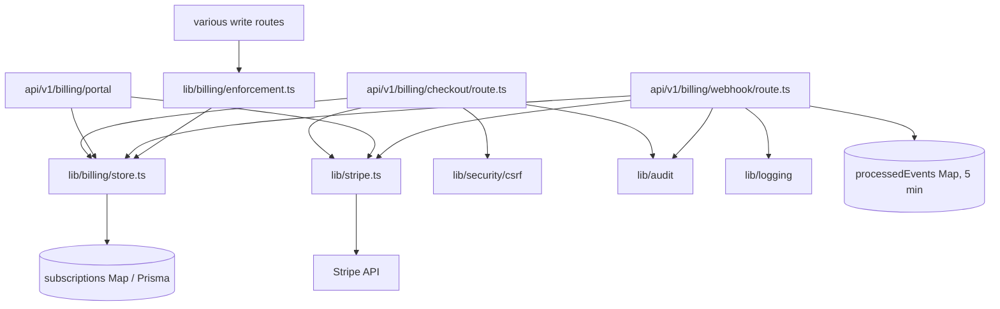
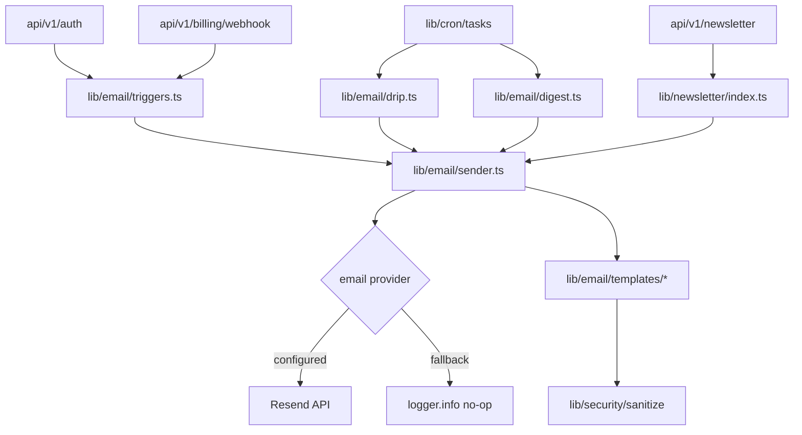
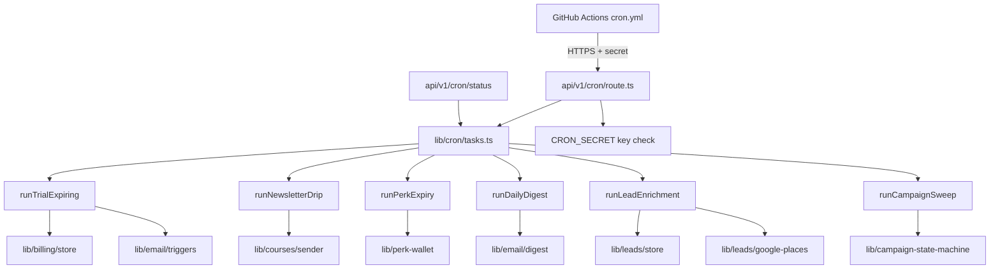
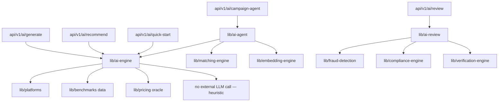

# Social Perks — Architecture Maps (Audit Phase 1)

> Six maps grounded in the current codebase at `claude/friendly-liskov`. Read this
> alongside `01-overview.md`. Where behavior depends on environment (e.g. Stripe
> configured vs. mock, Postgres vs. in-memory), both branches are noted.

Contents:

1. [Dependency Map](#1-dependency-map)
2. [Risk Map](#2-risk-map)
3. [Failure-point Map](#3-failure-point-map)
4. [Critical-path Map](#4-critical-path-map)
5. [User-flow Map](#5-user-flow-map)
6. [Data-flow Map](#6-data-flow-map)

---

## 1. Dependency Map

Top-level dependencies between major modules. Arrows point from caller to
callee. Diagrams are kept narrow on purpose — one subsystem per graph.

### 1.1 Auth subsystem

```mermaid
graph TD
  AuthRoute[api/v1/auth/route.ts] --> AuthLib[lib/auth/index.ts]
  AuthRoute --> CSRF[lib/security/csrf]
  AuthRoute --> RateLimit[lib/security/rate-limiter]
  AuthRoute --> Audit[lib/audit]
  AuthRoute --> Email[lib/email/triggers]

  AuthLib --> Crypto[node:crypto scrypt + HMAC]
  AuthLib --> Users[(users Map / Prisma)]
  AuthLib --> Sessions[(sessionStore Map)]
  AuthLib --> JWT[JWT signer HS256]

  TOTPRoute[api/v1/auth/totp] --> TOTP[lib/auth/totp.ts]
  TOTP --> Crypto

  OAuthStart[api/v1/auth/oauth/connect] --> OAuthProviders[lib/auth/oauth-providers]
  OAuthCallback[api/v1/auth/oauth/&#91;provider&#93;/callback] --> OAuthProviders
  OAuthCallback --> AuthLib
  OAuthProviders --> ExternalProviders[Google / GitHub / etc]

  SessionsRoute[api/v1/auth/sessions] --> AuthLib

  Middleware[src/middleware.ts] --> AuthLib
```



Notes:

- `sessionStore` is an in-process `Map`. Multi-instance deploys lose sessions on
  any non-sticky restart. JWTs continue to validate via signature, but
  server-side revocation is per-instance only.
- `users` is the same dual-mode store as everywhere else: Prisma when
  `DATABASE_URL` is set, in-memory `Map` otherwise.
- Password hashing uses `crypto.scrypt` (synchronous-ish, ~100ms per hash). No
  external KDF dependency.

### 1.2 Billing subsystem



Notes:

- `processedEvents` Map provides replay protection but only for ~5 minutes.
  Stripe retries beyond that window are not guarded against duplicate
  application of `checkout.session.completed`.
- Webhook does NOT use CSRF — Stripe-Signature header is the auth.
- `lib/billing/enforcement.ts` is called by feature routes to gate Pro-only
  capabilities (lead-finder, advanced AI, etc.).

### 1.3 Lead-finder subsystem

```mermaid
graph TD
  SearchRoute[api/v1/leads/search/route.ts] --> Places[lib/leads/google-places]
  SearchRoute --> Scorer[lib/leads/scorer]
  SearchRoute --> LeadsStore[lib/leads/store]
  SearchRoute --> Enforcement[lib/billing/enforcement]
  SearchRoute --> RateLimit[lib/security/rate-limiter]

  LeadsList[api/v1/leads/route.ts] --> LeadsStore
  LeadDetail[api/v1/leads/&#91;id&#93;/route.ts] --> LeadsStore
  LeadsExport[api/v1/leads/export] --> LeadsStore

  Places --> GooglePlacesAPI[Google Places API]
  Places --> MockData[mock fallback when no API key]

  LeadsStore --> LeadsMap[(leads Map / Prisma)]

  Outreach[lib/outreach] --> AIEngine[lib/ai-engine]
  LeadDetail --> Outreach
```



### 1.4 Email subsystem (Resend + templates)



Notes:

- `Sender` swallows errors and returns success to callers — by design (avoid
  blocking signup if Resend is slow). See risk map and failure map.
- Sanitization is on the template, not the input — XSS protection assumes every
  template runs `escapeHtml` on dynamic interpolations.

### 1.5 Cron + task subsystem



Notes:

- Cron is HTTP-pull (GitHub Actions → app). No durable task queue.
- Each task is responsible for its own idempotency. `runTrialExpiring`
  explicitly notes it relies on running once per day; running twice would send
  duplicate emails.

### 1.6 AI agent subsystem



Notes:

- The "AI engine" today is heuristic / rules-based — not a model API call. It
  composes responses from `platforms.ts`, benchmark data, and a pricing oracle.
  This matters for the failure map: there's no third-party LLM dependency in
  the request path.
- AI routes are still rate-limited (`strict` tier) because they're CPU-heavier
  than reference-data routes.

---

## 2. Risk Map

Severity legend: **HIGH** = data loss, security breach, money loss, or
multi-customer outage; **MEDIUM** = degraded UX or single-customer impact;
**LOW** = annoyance or recoverable inconsistency.

| # | System | Risk | Severity | Mitigation |
|---|--------|------|----------|------------|
| 1 | Billing webhook | Stripe retries past 5-minute replay window cause duplicate subscription writes | HIGH | Persist processed event IDs to DB for 7+ days; key off `event.id` in `subscriptions` upsert |
| 2 | Billing webhook | If signature verification is skipped (no `STRIPE_WEBHOOK_SECRET`), an attacker who finds the URL can forge subscription events | HIGH | Fail closed in production when secret missing; current code falls through to unsigned mode in dev |
| 3 | Auth — sessions | `sessionStore` is in-process Map; revoking a session on instance A leaves it valid on instance B | HIGH | Move sessionStore to Redis or DB; or rely on short access TTL + refresh rotation |
| 4 | Auth — JWT | JWT secret rotation has no grace period — rotating invalidates every active session | MEDIUM | Support N-of-M signing keys; verify against either during rotation window |
| 5 | Auth — JWT | No revocation list — a leaked JWT is valid until expiry regardless of "logout" | MEDIUM | 15-min access TTL limits blast radius; pair with refresh token rotation |
| 6 | Auth — password reset | Reset tokens generated via `crypto.randomBytes`, but stored in same in-memory Map as sessions — restart invalidates outstanding resets | MEDIUM | Persist to DB; or document the constraint |
| 7 | Auth — TOTP | Recovery codes (if implemented) not yet hashed at rest | MEDIUM | Hash recovery codes with the same scrypt params as passwords |
| 8 | Auth — login | No account lockout after N failed attempts (only rate-limit) | MEDIUM | Add exponential backoff + lockout on 10 consecutive failures |
| 9 | OAuth callback | `state` parameter is validated, but if the in-memory state Map evicts before callback returns, login fails silently | LOW | Persist state to short-lived DB row with TTL |
| 10 | Newsletter signup | Welcome email send is fire-and-forget; if Resend rejects, subscriber still recorded but receives nothing | MEDIUM | Queue the send; surface delivery status in admin UI |
| 11 | Cron — newsletter drip | If GitHub Actions runs twice in the same day (manual re-run), subscribers get duplicate lessons because `markLessonSent` is the only guard and is per-lesson, not per-day | MEDIUM | Add unique constraint `(subscriberId, lessonId)` in DB or check before send |
| 12 | Cron — trial reminder | `runTrialExpiring` emails everyone whose `currentPeriodEnd` is in the next 3 days every run — duplicate sends if cron runs more than once per day | MEDIUM | Add `lastTrialReminderSentAt` field; check before sending |
| 13 | Cron — secret | `CRON_SECRET` is a single static value; rotation requires coordinated workflow + env update | LOW | Document rotation procedure; consider OIDC from GitHub Actions instead |
| 14 | Cron — endpoint discoverability | `/api/v1/cron` is reachable from the public internet; only the `key` query param gates access | MEDIUM | Restrict by IP (GitHub Actions ranges) or use OIDC; current secret-in-URL leaks via referer/logs |
| 15 | Stripe checkout | If user closes the Stripe page without completing, no record of attempt — affects funnel analytics | LOW | Log checkout-session-created event |
| 16 | Stripe checkout | `client_reference_id` is the only link from session to businessId; missing it on a real charge would create an orphan subscription | HIGH | Defensive check in webhook handler; alert on missing ref |
| 17 | Stripe portal | Customer ID lookup uses `BillingStore.findByBusinessId` — if a user's subscription is deleted, portal returns 404 instead of redirecting to checkout | LOW | Fall back to "no subscription, start one" flow |
| 18 | Database — dual mode | In-memory mode silently swallows writes on process restart; production with missing `DATABASE_URL` would be a disaster | HIGH | Refuse to boot in production without `DATABASE_URL` |
| 19 | Database — connection pool | PgBouncer at port 6543 in transaction mode prohibits prepared statements; some Prisma queries may break under load | MEDIUM | Use `pgbouncer=true` query param; validate at startup |
| 20 | Database — migrations | `db/migrations.ts` runs at startup; concurrent boots could race on schema changes | MEDIUM | Use Postgres advisory locks during migration |
| 21 | Lead-finder | Google Places API quota exceeded → falls back to mock data without surfacing the degradation to the user | MEDIUM | Return `degraded: true` flag in response; show banner in UI |
| 22 | Lead-finder | No PII review — leads pulled from Places may include personal contact info that needs CCPA/GDPR handling | HIGH | Document data lifecycle; add deletion endpoint that purges by `placeId` |
| 23 | Lead-finder | Outreach generation uses `lib/ai-engine` and `lib/outreach`; if a generated email contains the lead's name verbatim and goes out unattended, it could violate CAN-SPAM | MEDIUM | Outreach is currently human-in-the-loop (draft only); enforce that constraint in code |
| 24 | Email — Resend | API key leak gives attacker ability to send from the verified domain | HIGH | Store in environment, rotate quarterly, restrict to send-only scope |
| 25 | Email — bounce handling | No webhook for Resend bounces — high-bounce subscribers stay in active list and degrade sender reputation | MEDIUM | Add Resend webhook + suppression list |
| 26 | Email — templates | Templates rely on `escapeHtml` at the call site; missing it on one field is a stored-XSS-via-email vector | MEDIUM | Move escaping into a typed template helper that wraps every interpolation |
| 27 | CSRF | Token TTL is 24h; long-lived tabs (e.g. business owner on a laptop) hit 403 mid-session | LOW | Auto-refresh CSRF token via SSE or refresh hook |
| 28 | Rate limiter | In-memory counters reset on restart; an attacker who triggers a restart resets their bucket | MEDIUM | `distributed-rate-limiter.ts` exists — wire it up in production |
| 29 | Rate limiter | Keys by IP only; users behind shared NAT (offices, mobile carriers) share buckets | LOW | Key by `userId` when authenticated, IP when not |
| 30 | Audit log | Stored in-memory unless `DATABASE_URL` is set; logs lost on restart | HIGH | Persist always; consider append-only table |
| 31 | Audit log | No retention policy → unbounded growth | LOW | Add TTL or partitioning |
| 32 | Webhook receiver (`/api/v1/verification/webhook`) | HMAC verification exists but no replay window — same `nonce` could be reused | MEDIUM | Track nonces with 24h TTL |
| 33 | Image upload | Image route accepts arbitrary content-type; no virus scanning | MEDIUM | Add MIME sniff + clamav or signed upload via S3 with content-type lock |
| 34 | Image upload | No max-size enforcement at edge; large body lands in Node and OOMs | MEDIUM | Enforce `Content-Length` check before reading body |
| 35 | OpenAPI spec | Hand-edited next to handlers — drifts when routes change without spec update | LOW | Generate from zod schemas |
| 36 | i18n | Missing keys silently fall through to EN — users see English fragments in ES/PT pages | LOW | Throw in dev, log in prod |
| 37 | Service worker | Aggressive caching of `/api/v1/*` would serve stale auth state | MEDIUM | Confirm `sw.js` excludes `/api/` paths from cache |
| 38 | Search | `lib/search` builds TF-IDF index in-memory at boot from `seed.ts`; cold start is slow on large datasets | LOW | Lazy-build or persist serialized index |
| 39 | Plugin system | `lib/plugin-system.ts` allows arbitrary plugin registration — if exposed to user input, RCE | HIGH | Confirm registration is build-time only; never accept plugin code over HTTP |
| 40 | Sandbox endpoint | `POST /api/v1/sandbox` runs against an isolated store, but if isolation breaks it could pollute prod data | MEDIUM | Add E2E test that asserts sandbox writes don't reach `subscriptions`, `leads`, etc. |

---

## 3. Failure-point Map

For each external dependency: what breaks, what the code does today, and
whether that's acceptable.

| Dependency | Failure mode | Current behavior | Acceptable? |
|------------|--------------|------------------|-------------|
| Postgres (Supabase/Neon) | DB down | Health check returns 503; write routes throw and return 500 | OK for now; missing graceful degradation for read-only mode |
| Postgres | Slow query / connection pool exhausted | Request hangs to default Next.js timeout (~30s) | NOT OK — add per-query timeout |
| Postgres | `DATABASE_URL` missing in prod | App boots in in-memory mode silently | NOT OK — should refuse to boot |
| PgBouncer | Restart drops in-flight transactions | Prisma retries via client logic, may double-write | Partial — add idempotency on critical writes |
| Stripe API | Outage during checkout | `POST /api/v1/billing/checkout` returns 502; user sees error | OK |
| Stripe API | Outage during webhook | Stripe retries with exponential backoff for 72h; replay map only covers 5 min so retries past that may double-apply | NOT OK — see risk #1 |
| Stripe webhook | Bad signature | Returns 401; logged with `outcome=errored` | OK |
| Stripe webhook | Missing `client_reference_id` | Subscription is stored with no businessId link; user sees "no subscription" on dashboard despite paying | NOT OK — alert and fail loud |
| Resend | API down | Sender catches error and returns success to caller; user-visible flows continue but no email is sent | OK by design; need bounce surfacing |
| Resend | API slow (>10s) | Sender's internal timeout kicks in, logs error, returns success | OK |
| Resend | Quota exceeded | Same as "down" — silent | NOT OK — surface to admin |
| Google Places API | Quota exceeded | `lib/leads/google-places.ts` falls back to mock data | Partial — flag degradation to user |
| Google Places API | Key invalid | Falls back to mock data | NOT OK — should alert ops |
| GitHub Actions (cron) | Workflow disabled or repo paused | Cron tasks don't run; trial reminders, perk expiry, digest stop silently | NOT OK — add heartbeat from app side (alert if no cron in 25h) |
| GitHub Actions (cron) | Workflow runs twice (manual re-run) | Tasks execute twice; some (trial reminder, drip) send duplicate emails | NOT OK — see risk #11, #12 |
| OAuth provider (Google/GitHub) | Provider down | Callback returns generic 500 | OK |
| OAuth provider | State expired | Login returns "state invalid" error | OK |
| Service worker (PWA) | SW serves stale `/auth/me` | User sees logged-in shell after logging out | NOT OK — confirm SW excludes `/api/` |
| Redis (if added later) | Down | Rate-limit + sessionStore degrade to in-memory per instance | OK for soft state |
| Object storage / S3 (images) | Bucket unreachable | Image upload fails with 502 | OK |
| Object storage | Image GET fails | Frontend shows broken image | OK; could use placeholder |

---

## 4. Critical-path Map

Paths the business MUST keep working. Each step lists what breaks if it fails.

### 4.1 Signup → Trial activation

1. `POST /api/v1/auth` with `action=signup`
   - **Fails if:** Postgres down (no user persisted), Resend down (welcome
     email skipped — still completes), CSRF token expired (403).
2. User row created in `users` table (or Map).
3. Session token issued; refresh token persisted to `sessionStore`.
4. JWT set as httpOnly cookie; `X-Set-Auth` Bearer header returned.
5. Welcome email enqueued via `lib/email/triggers.onSignup`.
6. Redirect to `/onboarding`.

**Breaks the business if:** step 2 fails (no user = no funnel) or step 3 fails
(user can't proceed).

### 4.2 Upgrade → Stripe checkout → Subscription recorded

1. `POST /api/v1/billing/checkout` with `priceId` and CSRF token.
   - **Fails if:** Stripe not configured, business has no `customerId` yet
     (auto-created), CSRF mismatch.
2. Session created via Stripe API with `client_reference_id = businessId`.
3. User redirected to Stripe Payment Link / Checkout.
4. User completes payment on Stripe.
5. Stripe sends `checkout.session.completed` to `/api/v1/billing/webhook`.
   - **Fails if:** signature invalid, replay window blocks duplicate retry,
     `client_reference_id` missing.
6. Webhook resolves `businessId` from `client_reference_id`; upserts
   `subscription` row with `status=active` and price/interval.
7. Audit event written; success email triggered.
8. User returns to `/billing/success` and sees Pro features unlocked.

**Breaks the business if:** step 5 misses or step 6 silently drops the
businessId link — user paid but app doesn't know.

### 4.3 Renewal billing

1. Stripe charges card on schedule.
2. Sends `invoice.payment_succeeded` → webhook updates `currentPeriodEnd`.
3. If payment fails: `invoice.payment_failed` → webhook marks
   `status=past_due`, triggers dunning email.
4. After Stripe's smart-retry exhausts: `customer.subscription.deleted` →
   webhook downgrades to free tier.

**Breaks the business if:** webhook misses dunning event → user keeps Pro
access without paying, or webhook misses delete event → user pays but is shown
as canceled.

### 4.4 Cron drip email (newsletter course)

1. GitHub Actions workflow `cron.yml` triggers daily.
2. Workflow hits `GET /api/v1/cron?task=newsletter-drip&key=$CRON_SECRET`.
3. Cron route validates `key === CRON_SECRET`.
4. `runNewsletterDrip` reads due lessons via `getDueLessons`.
5. For each lesson: send via Resend, then `markLessonSent`.

**Breaks the business if:** step 2 fails silently (workflow disabled). Need
heartbeat: app alerts if no cron run in 25h.

### 4.5 Campaign creation

1. `POST /api/v1/campaigns` with auth + CSRF.
2. Enforcement check: free tier allows N campaigns, Pro unlimited.
3. State machine transitions: `draft → review → live`.
4. AI generation (optional) via `POST /api/v1/ai/generate`.
5. QR code + share link generated.
6. Audit event written.

**Breaks the business if:** state machine rejects a valid transition (bug) or
enforcement misreads subscription tier (silent over/undergating).

### 4.6 Submission review

1. Customer submits proof via `POST /api/v1/submissions` (or public widget).
2. AI review pipeline runs via `lib/ai-review` (fraud + compliance + platform
   verification).
3. Business reviews via `/dashboard/submissions`.
4. `POST /api/v1/submissions/review` approves or rejects.
5. On approve: perk wallet credited, audit event written, customer notified
   via email.

**Breaks the business if:** approve event doesn't credit the wallet (lost
reward) or fraud detection false-positives en masse (legit customers blocked).

### 4.7 Public widget / campaign page

1. `GET /campaign/[campaignId]` server-rendered.
2. OG image generated.
3. Widget script (`/api/v1/widget/embed`) served with CDN cache.
4. Customer scans QR or clicks → lands on campaign page.
5. Action submission posts to `/api/v1/submissions` (auth optional).

**Breaks the business if:** widget script 5xx (every embed on every customer
site is broken), or campaign page renders 500.

### 4.8 Lead-finder search → outreach

1. Pro user opens lead-finder UI.
2. `POST /api/v1/leads/search` with query + filters.
3. Enforcement gates to Pro tier.
4. `lib/leads/google-places.searchPlaces` returns results (or mock).
5. `lib/leads/scorer` ranks by relevance.
6. User selects a lead → `lib/outreach` generates personalized draft.
7. User reviews + sends manually (no auto-send).

**Breaks the business if:** Pro gating misfires (free users get Places quota
hit), or scorer returns wrong order (unhelpful product).

### 4.9 Admin operations

1. `/admin` UI gated by admin role.
2. Routes: rate-limits, audit log, feature flags, leads CRM.
3. Each backed by `/api/v1/admin/*` or `/api/v1/audit`.

**Breaks the business if:** admin role check is bypassable (already audited),
or audit log is empty (forensics impossible).

### 4.10 Health + observability

1. `/api/v1/health` returns 200 with DB ping + email ping.
2. Vercel / Render health probe hits this every minute.
3. Logs ship to stdout in structured JSON.

**Breaks the business if:** health check returns 200 while DB is down (false
green) — verify it actually pings.

---

## 5. User-flow Map

### 5.1 Visitor (no account)

```mermaid
flowchart TD
  Land[Landing page /] --> Demo{Try demo<br/>or sign up?}
  Demo -->|Demo| DemoFlow[/?demo=1 — seed data loaded]
  Demo -->|Sign up| AuthForm[/auth signup form]
  AuthForm --> POST[POST /api/v1/auth signup]
  POST -->|success| Onboarding[/onboarding wizard]
  POST -->|fail| AuthForm
  Onboarding --> FirstCampaign[Create first campaign]
  FirstCampaign --> Share[Share link + QR]
  DemoFlow --> Dashboard[/dashboard read-only demo]
```

### 5.2 Trial user

```mermaid
flowchart TD
  Onboard[Onboarding done] --> Dash[/dashboard]
  Dash --> Create[Create campaign]
  Create --> AI{Use AI<br/>generator?}
  AI -->|Yes| GenAI[POST /api/v1/ai/generate]
  AI -->|No| Manual[Manual editor]
  GenAI --> Review[Review draft]
  Manual --> Review
  Review --> Launch[POST /api/v1/campaigns — launch]
  Launch --> Submissions[Watch submissions roll in]
  Submissions --> Approve[Approve / reject in /dashboard/submissions]
  Approve --> Trial5Day[5 days into trial]
  Trial5Day --> ReminderEmail[Trial-expiring reminder email]
  ReminderEmail --> Decision{Upgrade?}
  Decision -->|Yes| Upgrade[Go to /pricing → checkout]
  Decision -->|No| Expire[Trial ends, downgraded to free tier]
```

### 5.3 Paid user

```mermaid
flowchart TD
  Pro[/dashboard with Pro badge] --> More[Create more campaigns]
  More --> MultiLoc[Multi-location toggle]
  MultiLoc --> Reports[/reports — analytics]
  Reports --> Renewal{Renewal<br/>cycle hit?}
  Renewal -->|Success| Continue[Continue Pro]
  Renewal -->|Fail| Dunning[Dunning emails]
  Dunning --> UpdateCard[Update payment via Stripe portal]
  UpdateCard --> Pro
  Pro --> LeadFinder[Open lead-finder]
  LeadFinder --> Search[POST /api/v1/leads/search]
  Search --> Outreach[Generate outreach draft]
  Outreach --> SendManually[User sends from their own email]
```

### 5.4 Influencer

```mermaid
flowchart TD
  Land[Landing /] --> SignupInf[/auth?role=influencer]
  SignupInf --> Profile[Fill profile + rate card]
  Profile --> Browse[/discover — browse campaigns]
  Browse --> Apply[Apply to campaign]
  Apply --> Approved{Approved by<br/>business?}
  Approved -->|Yes| DoAction[Post content per action spec]
  Approved -->|No| Browse
  DoAction --> Submit[POST /api/v1/submissions with proof]
  Submit --> AIReview[lib/ai-review runs in background]
  AIReview --> BusinessReview[Business reviews + approves]
  BusinessReview --> Reward[Perk credited to wallet]
  Reward --> Redeem[Redeem perk]
```

### 5.5 Admin

```mermaid
flowchart TD
  Login[/auth admin] --> AdminDash[/admin]
  AdminDash --> Audit[/audit — search audit log]
  AdminDash --> Flags[/flags — feature flag CRUD]
  AdminDash --> RateLimits[/admin/rate-limits — stats + reset]
  AdminDash --> LeadsCRM[/admin/leads — leads CRM view]
  AdminDash --> CronStatus[/cron/status — last run per task]
  LeadsCRM --> Convert[Convert lead → customer]
  Convert --> Manual[Manually trigger signup flow]
```

---

## 6. Data-flow Map

How data moves through the system, end to end.

### 6.1 Authentication

```mermaid
flowchart LR
  User[User browser] -- form post --> AuthRoute[/api/v1/auth]
  AuthRoute -- validate --> CSRF[lib/security/csrf]
  AuthRoute -- rate-limit --> RL[lib/security/rate-limiter]
  AuthRoute -- create user --> Users[(users Map / Prisma)]
  AuthRoute -- create session --> Sessions[(sessionStore Map)]
  AuthRoute -- sign --> JWT[lib/auth sign HS256]
  JWT -- httpOnly --> Cookie[Set-Cookie sp_session]
  AuthRoute -- audit --> Audit[lib/audit append]
  AuthRoute -- enqueue welcome --> EmailTriggers[lib/email/triggers]
  EmailTriggers -- send --> Resend[Resend API]
  AuthRoute -- response --> User
```

### 6.2 Subscription lifecycle

```mermaid
flowchart LR
  User -- POST checkout --> CheckoutRoute[/api/v1/billing/checkout]
  CheckoutRoute -- create session --> StripeAPI[Stripe API]
  StripeAPI -- URL --> CheckoutRoute
  CheckoutRoute -- redirect --> StripePage[Stripe-hosted page]
  User -- pays --> StripePage
  StripePage -- webhook --> WebhookRoute[/api/v1/billing/webhook]
  WebhookRoute -- verify sig --> StripeAPI
  WebhookRoute -- check replay --> ReplayMap[(processedEvents 5min)]
  WebhookRoute -- upsert --> Subscriptions[(subscriptions Map / Prisma)]
  WebhookRoute -- audit --> Audit[lib/audit]
  WebhookRoute -- trigger email --> EmailTriggers[lib/email/triggers]
  EmailTriggers -- send --> Resend
  Subscriptions -- read --> Enforcement[lib/billing/enforcement]
  Enforcement -- gate --> ProRoutes[Pro-only routes]
```

### 6.3 Lead search

```mermaid
flowchart LR
  User -- POST search --> SearchRoute[/api/v1/leads/search]
  SearchRoute -- gate --> Enforcement[lib/billing/enforcement]
  Enforcement -- read --> Subscriptions[(subscriptions)]
  SearchRoute -- query --> Places[lib/leads/google-places]
  Places -- HTTP --> GoogleAPI[Google Places API]
  GoogleAPI -- results --> Places
  Places -- fallback when err --> Mock[mock dataset]
  Places -- rows --> Scorer[lib/leads/scorer]
  Scorer -- ranked --> SearchRoute
  SearchRoute -- persist --> LeadsStore[(leads Map / Prisma)]
  SearchRoute -- response --> User
```

### 6.4 Newsletter signup → welcome email

```mermaid
flowchart LR
  User -- POST email --> NewsletterRoute[/api/v1/newsletter]
  NewsletterRoute -- validate --> Validate[lib/security/validate]
  NewsletterRoute -- store --> NewsletterLib[lib/newsletter]
  NewsletterLib -- write --> Subscribers[(subscribers Map / Prisma)]
  NewsletterRoute -- send confirmation --> Sender[lib/email/sender]
  Sender -- template --> Templates[lib/email/templates/newsletter-confirmation]
  Sender -- HTTPS --> Resend[Resend API]
  Resend -- accepts --> Sender
  Sender -- swallow err on fail --> Logger[lib/logging]
  NewsletterRoute -- response --> User
```

### 6.5 Cron job execution

```mermaid
flowchart LR
  GHA[GitHub Actions cron.yml] -- HTTPS+secret --> CronRoute[/api/v1/cron?task=X]
  CronRoute -- validate --> Secret[CRON_SECRET env]
  CronRoute -- dispatch --> Tasks[lib/cron/tasks]
  Tasks -- runTrialExpiring --> BillingStore[(subscriptions)]
  Tasks -- runTrialExpiring --> EmailTriggers[lib/email/triggers]
  Tasks -- runNewsletterDrip --> CoursesSender[lib/courses/sender]
  CoursesSender -- mark sent --> LessonsState[(lessonsSent Map / Prisma)]
  CoursesSender -- send --> Resend
  Tasks -- runPerkExpiry --> Wallet[(perkWallet)]
  Tasks -- runDailyDigest --> DigestLib[lib/email/digest]
  DigestLib -- aggregate --> Analytics[lib/analytics-engine]
  Tasks -- runLeadEnrichment --> LeadsStore[(leads)]
  Tasks -- runCampaignSweep --> StateMachine[lib/campaign-state-machine]
  CronRoute -- write --> CronStatus[(last run per task)]
  CronRoute -- response --> GHA
```

### 6.6 Campaign submission → review → reward

```mermaid
flowchart LR
  Customer -- POST submission --> SubRoute[/api/v1/submissions]
  SubRoute -- store --> Submissions[(submissions)]
  SubRoute -- enqueue --> AIReview[lib/ai-review]
  AIReview -- fraud check --> Fraud[lib/fraud-detection]
  AIReview -- compliance check --> Compliance[lib/compliance-engine]
  AIReview -- platform verify --> Verification[lib/verification-engine]
  Verification -- HTTP --> SocialAPI[Platform API or scraper]
  AIReview -- score+flags --> Submissions
  Business -- POST review --> ReviewRoute[/api/v1/submissions/review]
  ReviewRoute -- update --> Submissions
  ReviewRoute -- credit on approve --> Wallet[lib/perk-wallet]
  Wallet -- write --> WalletStore[(perk balances)]
  ReviewRoute -- email customer --> Sender[lib/email/sender]
  Sender -- HTTPS --> Resend
  ReviewRoute -- audit --> Audit[lib/audit]
```

### 6.7 Stripe webhook (detail)

```mermaid
flowchart TD
  Stripe[Stripe] -- POST signed body --> WebhookRoute[/api/v1/billing/webhook]
  WebhookRoute -- check sig header --> SigCheck{stripe.webhooks.constructEvent}
  SigCheck -- invalid --> Err401[401 MISSING/INVALID_SIGNATURE]
  SigCheck -- valid --> Replay{event.id in<br/>processedEvents?}
  Replay -- yes --> Skip[outcome=skipped, 200]
  Replay -- no --> Record[set processedEvents&#91;id&#93; = now]
  Record --> Type{event.type}
  Type -- checkout.session.completed --> Complete[resolve businessId via client_reference_id]
  Type -- customer.subscription.updated --> Update[update period/status/price]
  Type -- customer.subscription.deleted --> Cancel[mark canceled]
  Type -- invoice.payment_failed --> Dunning[mark past_due + email]
  Complete --> Subs[(subscriptions upsert)]
  Update --> Subs
  Cancel --> Subs
  Dunning --> Subs
  Subs --> Audit[lib/audit]
  Audit --> Resp[200 OK + outcome=processed]
```

---

## Appendix A — Map ownership

| Map | Owner (suggested) | Refresh cadence |
|-----|-------------------|-----------------|
| Dependency | Backend lead | When a subsystem is added or split |
| Risk | Security lead + backend lead | Quarterly + after any incident |
| Failure-point | SRE / on-call | Quarterly + after any incident |
| Critical-path | Product + engineering | Whenever a critical path changes |
| User-flow | Product | Per major release |
| Data-flow | Backend lead + privacy reviewer | When new data sources are added |

## Appendix B — Conventions

- All `(parentheses)` in mermaid graphs are data stores; squared `[brackets]`
  are code modules or routes; curly `{braces}` are decision nodes.
- "Map / Prisma" means the dual-mode store: in-memory `Map` when `DATABASE_URL`
  is unset, Prisma-backed Postgres otherwise.
- Severity in the risk map is calibrated to a small but real customer base —
  HIGH means user-visible or money-affecting, not "in theory bad".
